# CraftXR Character Pipeline: CC4 → (Blender repair) → Unity, VR-ready

**Status:** Design v0.3 (character-only; adds color management and realism, detailed in `craftxr-character-color-realism-spec.md`)
**Owner:** Hamza
**Target:** Quest 3 standalone · URP · Meta XR All-in-One SDK · SALSA LipSync · Addressables on Azure Blob
**Out of scope:** environments and props. They go in a sibling project that reuses the same approach (§12 defines the contract between the two).

---

## 1. Goal

Produce patients, partners, and bystanders that hold up **at arm's length in a headset**, where a paramedic student kneels next to them, and that run at 72 FPS on Quest 3. Every character is:
- **reproducible:** regenerated from a recipe file
- **agent-operable:** Claude Code drives CC4, Blender, and Unity over MCP
- **gated:** humans approve at three checkpoints

## 2. What "top notch" means for a VR character

Close-range VR exposes different flaws than a monitor does. The headset review (Gate 3) scores each area pass/fail.

| Area | Pass criteria in headset |
|---|---|
| **Eyes** | Eyes blink, saccade, and gaze toward the learner. No dead stare, no visible gap between eyeball and lids. |
| **Face and lips** | Lip-sync reads clearly on the Azure/Inworld TTS audio. The jaw doesn't clip teeth. Idle micro-expressions keep the face from freezing between lines. |
| **Skin** | No plastic sheen or waxy flatness under the test lighting. Detail comes through normal maps. Clinical tints (pallor, cyanosis, flushing) read correctly. |
| **Hair** | No shimmering or sorting artifacts at 30–60 cm. No bald-looking scalp gaps. |
| **Clothing** | No body poke-through at the extremes of the character's poses. |
| **Body and motion** | Real-world height and scale. Breathing or idle motion never fully stops. The pose fits the scenario (standing, seated, supine). |
| **Stability** | No LOD pop inside 1.5 m. No shader flicker across both eyes. |
| **Color accuracy** | The calibration kit (ColorChecker, grey card, MST strip) reads correctly first. Skin shows no pink/oversaturated cast, no plastic sheen, and no muddy shadows on dark tones. |
| **Clinical signs** | Each active sign appears at the correct sites for that skin tone (spec Part C3) and transitions smoothly. It's noticeable at 1 m without looking cartoonish. |

## 3. Key decisions

**D1. CC4 owns the mesh, rig, and face. Blender never re-rigs.**
CC4 exports already carry a humanoid-compatible skeleton and the facial blendshapes that SALSA binds to. Blender is a conditional repair stage only.

**D2. The primary import path is CC4 → CCiC Unity Tools → Unity.**
[soupday/CCiC-Unity-Tools](https://github.com/soupday/CCiC-Unity-Tools):
- supports CC 3/4/5 on every Unity pipeline
- offers high-fidelity or performance-focused shader sets
- can import directly from CC4 via DataLink
- has a Blender-in-the-middle route, so the repair stage needs no separate import path

**D3. Optimize in CC4 first.**
CC4's InstaLOD handles polygon reduction, material merging by type (Character / Hair / Clothes / Accessories), baking, and LOD generation. ActorBUILD swaps in a 10k Game Base with 101 bones that keeps facial animation. Probe #2 decides how much of this Python can drive; the rest becomes a checklist step.

**D4. SALSA owns the face at runtime.**
Crazy Minnow's guidance is not to export blendshape animations and to let the SALSA Suite drive facial animation. Use the **CC3 OneClick** for CC exports. Note that OneClicks bind by mesh, so **every optimization step must be re-checked against OneClick binding**. The fallback is SALSA's free CustomOneClick tool.

**D5. A character is a recipe, not a file.**
`recipe.json` (§6) is the source of truth. `.ccProject` files, FBX exports, and Unity prefabs are build artifacts, regenerated whenever the pipeline improves.

**D6. Irreversible CC4 operations run only on saved copies.**
ActorBUILD, LOD1/LOD2 conversion, and reductions can't be undone.

**D7. Color is managed end to end.**
- **Texture flags:** correct encoding per texture role.
- **Albedo:** within the physically plausible range.
- **Output gamut:** set explicitly on Quest.
- **Dark detail:** shadows kept above the LCD's dark floor.
- **Sign-off:** only in the headset, against a calibration kit.

Spec Part A.

**D8. Clinical signs are runtime physiology, not baked tints.**
- **Parameters:** `perfusion`, `oxygenation`, `bilirubin`, `diaphoresis`, `flush`, and `mottling`, driven by the sim state graph.
- **Where they show:** anatomical region masks, attenuated by pigmentation so each sign appears where it clinically does on that skin tone.
- **Skin tone coverage:** uses the Monk Skin Tone scale.

Spec Parts B–C.

## 4. Character budget

Meta's Quest 3 / 3S guidance for a medium-simulation app is about **400–600 draw calls and 1.3M–1.8M triangles per frame, at a minimum of 72 FPS**. That covers the whole scene.

**Proposed avatar share: ≤ 25% of the frame** (≤ ~150k triangles, ≤ ~40 draw calls) for the busiest scenario. The environments project owns the rest. These targets are ours, not Meta's, and get revised at milestone M2.

| Metric | Hero patient LOD0 (≤ 1.5 m) | LOD1 (1.5–4 m) | LOD2 / background bystander |
|---|---|---|---|
| Triangles, incl. hair and clothes | ≤ 60k | ≤ 25k (ActorBUILD) | ≤ 10k |
| Draw calls (materials) | ≤ 8 | ≤ 5 | ≤ 2 |
| Bones | CC standard | ≤ ~100 | reduced |
| Blendshapes | SALSA visemes + required emotes | SALSA visemes only | none |
| Textures | 2K head/body, 1K hair/clothes, ASTC | 1K, ASTC | 512, ASTC |

**Worked example, busiest scenario (patient + partner + 2 bystanders).** 1 × LOD0 + 1 × LOD1 + 2 × LOD2 comes to about 105k triangles and 17 draw calls, well inside the 25% share.

**Quest rendering rules for characters:**
- **Render mode:** Multiview stereo.
- **Hair:** MSAA alpha-to-coverage shaders from CCiC Unity Tools, or cutout. Never alpha blend, which causes overdraw on a tile-based GPU.
- **Eye overlays:** start with the eye-occlusion and tearline meshes baked or removed. Reintroduce them only if Gate 3 misses them.
- **Post-processing:** none on characters.

## 5. Pipeline stages

```mermaid
flowchart LR
  A[S0 Intake<br/>asset allowlist] --> B[S1 Author<br/>recipe → CC4 via MCP]
  B --> G1{Gate 1<br/>framed renders}
  G1 --> C[S2 Optimize in CC4<br/>on saved copy]
  C --> D[S3 Export<br/>FBX + JSON per LOD]
  D --> V{Validate<br/>budgets}
  V -- fail --> R[S4 Blender repair]
  R --> D2[Re-export via<br/>Blender Tools]
  V -- pass --> U[S5 Unity import<br/>CCiC Unity Tools]
  D2 --> U
  U --> S[S6 Assemble<br/>LODGroup, Humanoid,<br/>SALSA + Eyes, prefab]
  S --> G2{Gate 2<br/>validator report}
  G2 --> Q[S7 Headset test<br/>character lab scene]
  Q --> G3{Gate 3<br/>§2 checklist}
  G3 --> P[S8 Publish<br/>Addressables]
```



### S0 · Intake

- `assets/allowlist.json` lists every hair pack, clothing item, accessory, skin, and motion you own, with its license type and whether it can be exported.
- Only exportable (Standard License) items can appear in recipes.
- Each recipe records its Monk Skin Tone value, so the library's light/medium/dark coverage (spec Part B) can be checked automatically.
- The bridge rejects anything that isn't allowlisted.

### S1 · Author

1. Claude Code replays `recipe.json` through the CC4 bridge: base → morphs (resolved by display name) → skin and clinical tint → hair → clothes → colours.
2. The `healthcare-sim-designer` skill defines each archetype's clinical presentation (age, build, skin signs, scenario-appropriate clothing).
3. The bridge renders three framed views (full body, head close-up, three-quarter) for **Gate 1**. You approve the look before any optimization.

### S2 · Optimize (CC4, saved copy)

1. Remove hidden body mesh under clothing.
2. Merge materials by type.
3. Cap texture sizes per §4.
4. Generate LOD1 and LOD2 (ActorBUILD or InstaLOD). This is automated if probe #2 confirms Python access; otherwise it's a checklist step.
5. Prune expressions to the SALSA viseme and emote set the archetype needs.

### S3 · Export

- Unity preset, one FBX + JSON per LOD.
- "Mesh Only" for LOD group members.
- A separate motion export pulls the scenario's clips (idle, seated, supine where available) from the CC4 default library.
- The bridge runs export as a start-job and check-status pair.

### S4 · Blender repair (conditional)

Only triggered by a validation failure or a known issue:
- clothing reduction that InstaLOD mangles
- hair-card cleanup
- weight-paint fixes on clothing
- shape-key pruning
- UV atlasing

Use [CC/iC Blender Tools](https://github.com/soupday/cc_blender_tools) for import and export fidelity, and the official Blender Lab MCP for agent control. **Never re-rig, rename bones, or rename the body mesh** (renaming the mesh breaks SALSA OneClick).

### S5 · Unity import

CCiC Unity Tools in the URP project, using the performance shader set. The LOD Combining Tool assembles the LODGroup from the per-LOD exports.

### S6 · Assemble

- Humanoid avatar configuration.
- **SALSA CC3 OneClick**, plus EmoteR and Eyes for blinks, gaze, and idle expressions, wired to the voice pipeline's audio source.
- Prefab variant per archetype.
- `AvatarBudgetValidator` (editor script) reports triangles, draw calls, bones, blendshapes, and texture memory per LOD against §4, and fails the build on violation. It also checks texture sRGB/linear flags by role and flags albedo outside the plausible range (spec A2–A3). Its report is **Gate 2**.
- **Clinical sign layer:** region masks and physiology parameters (spec Part C2) wired to the sim state graph, with pigment attenuation per region.

### S7 · Headset test

- **Test scene:** a dedicated *character lab* scene, lit to the environments project's conventions (dynamic light probes; see §12), with marks at 0.5 m, 1.5 m, and 4 m and a kneeling camera position.
- **Scenario load:** spawn the busiest-scenario cast.
- **Measurement:** check OVR Metrics Tool, and Perfetto via Meta's `hz-perfetto-debug` skill.
- **Calibration kit first:** a virtual ColorChecker, 18% grey card, and MST strip at the patient position (spec A8). The output gamut setting is A/B tested here during M2.
- **Gate 3:** the §2 checklist, filled in while wearing the headset. Color is never signed off from screenshots or captures.

### S8 · Publish

- Addressables group per archetype, pushed to Azure Blob.
- Manifest records the recipe hash, pipeline version, validator report, and Gate 3 sign-off.

## 6. Recipe schema (draft)

```json
{
  "recipe_version": "0.1",
  "id": "patient-older-adult-m-01",
  "archetype": "older_adult_male",
  "clinical_presentation": ["pallor", "diaphoresis"],
  "base": { "gender": "male", "project_template": "CC4_Standard_Male" },
  "morphs": [
    { "display_name": "Body Heavy", "value": 0.35 },
    { "display_name": "Age", "value": 0.7 }
  ],
  "skin": { "preset": "allowlist:skin/older_fair_01", "tint": { "pallor": 0.4 } },
  "hair": "allowlist:hair/short_grey_02",
  "clothes": ["allowlist:clothes/plaid_shirt", "allowlist:clothes/work_pants"],
  "colors": { "eyes": [0.28, 0.22, 0.16] },
  "lod_profile": "hero",
  "motions": ["allowlist:motion/idle_breathing", "allowlist:motion/seated_idle"],
  "salsa": { "oneclick": "CC3", "emotes": ["pain", "concern"] }
}
```

- **Names are illustrative.** Morph display names and allowlist IDs get filled in during M1 from real CC4 data.
- **Morph matching.** The bridge resolves display names to internal morph IDs at replay time.
- **Unknown names.** A display name that doesn't resolve fails loudly; it's never silently skipped.

## 7. Archetype library (v1)

Start with 5–6 recipes that cover the first paramedic scenarios:
- older adult (M and F)
- middle-aged adult (M and F)
- young adult
- one bystander template with interchangeable clothing

Pediatric patients are a separate follow-up, since they need child-appropriate base content and motions.

## 8. Agent tooling (Windows workstation, orchestrated from Claude Code)

| MCP / CLI | Stages | Notes |
|---|---|---|
| **CC4 bridge** (ours) | S1–S3 | Kickoff Phases 0–4 plus §11 amendments |
| **Blender Lab MCP** (official) | S4 | Requires Blender 5.1+. It runs model-generated Python unguarded, so work on copies in a dedicated folder. |
| **Unity MCP** (Unity AI, Claude Code integration) | S5–S6 | Project Settings → AI → Unity MCP → Configure |
| **metavr CLI / MCP** (Meta) | S7 | Device, performance, logs; installed with the Meta plugin |

## 9. Skills (character pipeline only)

### Install now

| Skill | Source | Use in this pipeline |
|---|---|---|
| `hz-unity-fbx-import` | Meta agentic-tools (official) | S5 FBX import hygiene |
| `hz-unity-code-review` | Meta | Reviews validator and assembly scripts for Quest pitfalls |
| `hz-perfetto-debug`, `hz-simpleperf-debug` | Meta | S7 GPU/CPU cost of skinning, blendshapes, hair |
| `hz-vr-debug`, `hz-unity-project-analyzer` | Meta | Device logs; living project docs for the Unity side |
| `unity-cli`, `unity-package-management` | Unity-Technologies/skills (official) | Installing CCiC Unity Tools, SALSA, and Addressables packages headlessly |
| `shader-graph-create-custom-node` | Unity official | Skin, hair, or eye shader tweaks on top of the CCiC performance shaders |
| `color-expert` | [meodai/skill.color-expert](https://github.com/meodai/skill.color-expert) (CC BY 4.0) | General color science: OKLab/OKLCH, CIEDE2000 perceptual deltas, color vision deficiency simulation, simultaneous contrast. It's web/design-oriented and has no rendering pipeline content, which our skill adds. |
| `healthcare-sim-designer` | Already installed | Clinical presentation per archetype |

Install commands:
- **Meta plugin:** `/plugin marketplace add meta-quest/agentic-tools` then `/plugin install meta-vr@meta-quest`, and ignore the non-Unity skills.
- **Unity skills:** `npx skills add Unity-Technologies/skills`, then delete the ads, IAP, multiplayer, 2D, and web skills.

### Write ourselves (with Anthropic's `skill-creator`)

| Skill | Contents |
|---|---|
| `cc4-avatar-recipes` | Recipe schema, verified morph display names per archetype, allowlist, export profiles, SALSA-safe optimization rules |
| `vr-avatar-budgets` | §4 budgets, validator usage, cut order when over budget (textures → blendshapes → clothing tris → LOD distances), §2 headset checklist |
| `character-color-calibration` (**draft included**) | Color management chain, skin tone coverage, clinical signs across skin tones, realism diagnosis order, Gate 3 color review. Depends on `color-expert`. |

### Evaluate after M2

| Skill | Why wait |
|---|---|
| `hz-unity-face-tracking` (Meta) | Movement SDK Audio-to-Expression on ARKit-style blendshapes; a possible SALSA complement, but it depends on CC4's facial profile |
| `hz-unity-meta-movement-sdk-retargeting` (Meta) | Only if body tracking or mocap ever drives characters |
| `blender-python-addon` (mindrally, skills-hub.ai) | Only if S4 repairs become frequent enough to warrant an add-on. It's unsigned, so review it and pin it. |
| `blender-skills` retopology and export modules (arjun988) | Reference checklists only. Don't use its rigging skill (D1). |

### Moved to other projects

| Skill | Where it goes |
|---|---|
| Taste Skill (`design-taste-frontend`) | CraftXR authoring platform (Next.js) |
| `urp-postprocessing`, Blender environment and lighting skills | Environments & props project |
| `unity-xr` (skills-hub.ai) | Skip; it targets XR Interaction Toolkit, not the Meta XR SDK |

## 10. Licensing (not legal advice; confirm with Reallusion)

- **Standard License required for export.** Only Standard-licensed content may leave CC4 for Unity or Blender. iContent can't be exported. The allowlist enforces this.
- **No runtime character creation without Reallusion.** A feature letting instructors assemble characters from CC assets inside CraftXR likely needs Reallusion's Enterprise License. Choosing from our prebuilt archetypes avoids that question.

## 11. CC4 bridge amendments (add to kickoff Phase 2)

- `apply_recipe(recipe_json)` / `export_recipe()`
- `save_project_as(path)`: required before any irreversible operation
- `capture_views(presets=["full", "head", "three_quarter"])`: camera framed on the avatar; the probe render left it at about 10% of the frame
- `start_export_fbx(..., remove_hidden_mesh, texture_size_cap, mesh_only, lod_label)`
- `export_motions(clip_ids)`: allowlisted clips only
- `get_inventory()`: current items joined against the allowlist
- **Pending probe #2:** `convert_lod(level)` and `merge_materials(mode)`, run on copies only; otherwise emitted as checklist steps

## 12. Contract with the environments & props project

Both projects must agree on these so characters drop into any scene unchanged:

| Topic | Agreement |
|---|---|
| **Frame budget** | Avatars ≤ 25% of the Quest 3 frame budget (§4); environments own the rest. Revisit together after both device baselines. |
| **Lighting** | Characters are validated in the character lab under the same dynamic light-probe setup environments use. Any probe or lightmap convention change must be shared. |
| **Scale and pivots** | Metres, real-world height, pivot at the feet, Y-up, forward +Z. |
| **Interaction points** | Named transforms on the character prefab (e.g. `anchor_wrist_L`, `anchor_chest`, `anchor_head`) for sims to attach pulse checks, stickers, and props. Props never parent into the rig directly. |
| **Shared infrastructure** | Addressables conventions, the validator framework (with separate budget profiles), the manifest format, and the Gate structure are reused by the environments project. |

## 13. Milestones

| # | Milestone | Exit criteria |
|---|---|---|
| M0 | Probe #2 | JSON: ConvertTo, InstaLOD, and merge reachability; real bone, blendshape, and material counts |
| M1 | CC4 bridge MVP | Kickoff Phases 0–4 plus §11. One recipe replays identically twice. |
| M2 | **Golden path by hand** | One hero patient through S2–S7 manually. OneClick binds after optimization. Real Quest 3 numbers replace §4 guesses. Calibration kit built, output gamut A/B decided, and the spec's [M2] hypotheses resolved (e.g. UV-shared masks across archetypes). |
| M3 | Validator + our three skills | `AvatarBudgetValidator` fails an over-budget prefab and a mis-flagged texture. Clinical sign layer shows pallor and cyanosis correctly on MST ~2, ~5, and ~9. All three skills tested on M2's character. |
| M4 | Automated S1–S6 | Recipe → prefab through Gates 1–2 from Claude Code. Blender stage wired only for failures seen in M2. |
| M5 | Archetype library v1 | 5–6 recipes pass Gate 3 and are published via Addressables |

**M2 before M4:** automate only what you've measured.

## 14. Open questions

1. Which facial profile do your CC4 characters use (Traditional / CC4 Standard / Extended)? This decides SALSA viseme mapping and pruning.
2. What are your Unity and URP versions? Needed to pick the matching CCiC Unity Tools release.
3. How many characters are on screen in the busiest planned scenario? This validates the 25% share.
4. Do CC4's default motions include usable seated and supine poses for patients, or is that a content gap to fill (licensed motion packs or custom posing)?
5. Which clinical presentations do the first paramedic scenarios need? That decides which region masks and parameters M3 builds first.
6. Is a clinical reviewer available to sign off presentations on light, medium, and dark skin tones before scenarios ship?
